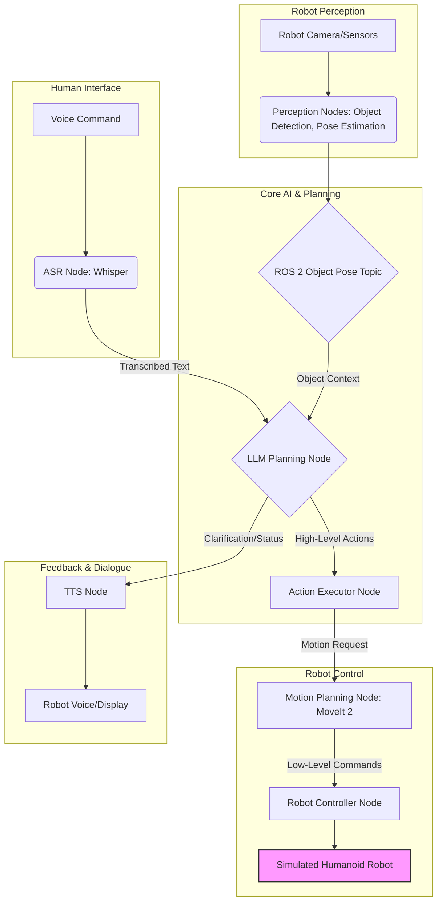

# Capstone Project: Autonomous Humanoid - System Design

This document outlines the high-level system design for the autonomous humanoid capstone project, integrating concepts from all previous modules. The design emphasizes modularity, leveraging ROS 2 as the primary communication middleware.

## 1. High-Level Architecture

The system follows a typical Vision-Language-Action (VLA) pipeline, orchestrated by ROS 2.

*Description*: High-level system architecture of the VLA humanoid robot, showing data flow between major components.

## 2. Component Breakdown and Integration

### 2.1. Human Interface Layer

*   **ASR (Automatic Speech Recognition) Node**:
    *   **Input**: Audio stream from a simulated microphone.
    *   **Output**: Transcribed text (`std_msgs/msg/String`) to `/robot/voice_command`.
    *   **Technology**: Simulated Whisper node (as in Module 4 example).

### 2.2. Core AI & Planning Layer

*   **LLM Planning Node**:
    *   **Input**: Transcribed text from ASR (`/robot/voice_command`), object poses from Perception (`/robot/object_poses`).
    *   **Output**: High-level robot actions (custom ROS 2 message or JSON string) to `/robot/planned_actions`, and potentially feedback text to TTS node.
    *   **Technology**: Simulated LLM (as in Module 4 example), integrating context from detected objects.
*   **Action Executor Node**:
    *   **Input**: High-level robot actions from LLM (`/robot/planned_actions`).
    *   **Output**: Triggers specific perception requests, navigation goals, or motion planning requests.
    *   **Role**: Acts as an orchestrator, translating LLM outputs into commands for other robot systems.

### 2.3. Robot Perception Layer

*   **Camera/Sensor Nodes**:
    *   **Input**: Raw simulated camera images (RGB-D) from Gazebo/Isaac Sim.
    *   **Output**: Image streams (`sensor_msgs/msg/Image`) and point clouds (`sensor_msgs/msg/PointCloud2`).
    *   **Technology**: Gazebo or Isaac Sim sensor plugins.
*   **Object Detection Node**:
    *   **Input**: RGB image stream.
    *   **Output**: 2D bounding boxes and class labels (`vision_msgs/Detection2DArray`).
    *   **Technology**: Simulated (e.g., placeholder node) or integrated (e.g., `isaac_ros_object_detection` conceptual).
*   **Pose Estimation Node**:
    *   **Input**: 2D detections, depth image/point cloud.
    *   **Output**: 6-DoF object poses (`geometry_msgs/msg/PoseStamped`) to `/robot/object_poses`.
    *   **Technology**: Simulated (e.g., placeholder node) or integrated.

### 2.4. Robot Control Layer

*   **Motion Planning Node**:
    *   **Input**: High-level motion requests from Action Executor (e.g., target pose for an object, navigation goal), current robot state (joint states, odometry).
    *   **Output**: Collision-free trajectory (`trajectory_msgs/msg/JointTrajectory`).
    *   **Technology**: MoveIt 2 (conceptual integration), or simple custom planner.
*   **Robot Controller Node**:
    *   **Input**: Trajectory from Motion Planning Node.
    *   **Output**: Low-level joint commands (`sensor_msgs/msg/JointState`) to the simulated robot.
    *   **Technology**: ROS 2 controllers for simulated robot (e.g., `ros2_control`).
*   **Simulated Humanoid Robot**:
    *   **Platform**: Modeled in Gazebo or Isaac Sim, possibly imported via URDF/SDF.
    *   **Role**: Physical (simulated) embodiment of the robot, executing commands.

### 2.5. Feedback & Dialogue Layer

*   **TTS (Text-to-Speech) Node**:
    *   **Input**: Text string for verbal feedback from LLM or other nodes (`/robot/tts_input`).
    *   **Output**: Simulated audio output (e.g., printed to console, or actual audio if integrated).
    *   **Technology**: Placeholder or external TTS service.

## 3. Communication Patterns

*   **Topics**: Used extensively for streaming data (sensor data, transcribed text, object poses, joint states).
*   **Services**: For single request/response interactions (e.g., `LLM Planning Node` querying specific object properties).
*   **Actions**: For long-duration, goal-oriented tasks (e.g., navigation to a room, complex manipulation sequences).

This modular design allows for independent development and testing of each component, while ROS 2 ensures seamless communication, enabling a flexible and scalable VLA system for the autonomous humanoid.