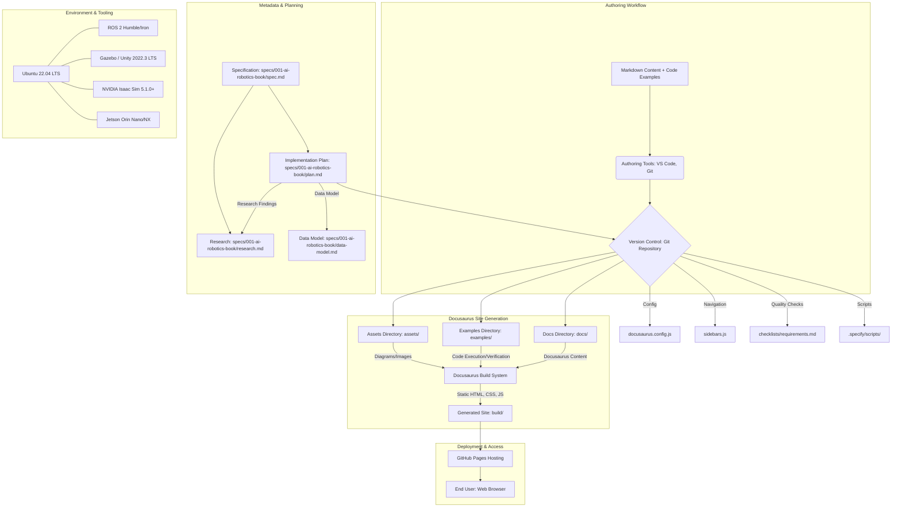

# Architecture Sketch: AI Robotics Textbook + Docusaurus Repository

## Overall System Architecture

The AI Robotics Textbook will be delivered as a static website built using Docusaurus, hosted on GitHub Pages. The repository structure is designed for modularity, maintainability, and easy content generation and updates.

## Component Breakdown

### 1. Content Modules (`docs/`)
Each core module (ROS 2, Gazebo/Unity, NVIDIA Isaac, Vision-Language-Action) and appendices will reside in its own subdirectory within `docs/`. Each module will have an `index.md` and subsequent `.md` files for sections.

### 2. Code Examples (`examples/`)
Runnable code examples will be stored in a parallel directory structure to `docs/`. Each example will be a self-contained Python script (primarily `rclpy`) designed to be executed on the specified hardware/software stack.

### 3. Assets (`assets/`)
This directory will contain all static assets like images, diagrams (generated from Mermaid syntax), and other media.

### 4. Docusaurus Configuration
*   `docusaurus.config.js`: Main configuration for the site, including title, tagline, plugins, and themes.
*   `sidebars.js`: Defines the navigation structure for the documentation, ensuring a logical learning progression.

### 5. Specifications and Planning (`specs/`)
Dedicated directory for all project management artifacts: `spec.md`, `plan.md`, `research.md`, `data-model.md`, and checklists.

### 6. Environment & Tooling
The development and execution environment is standardized on Ubuntu 22.04 with ROS 2 Humble/Iron. Simulation environments include Gazebo, Unity 2022.3 LTS, and NVIDIA Isaac Sim 5.1.0+. Jetson Orin Nano/NX will serve as the deployment target for physical robot control examples.
